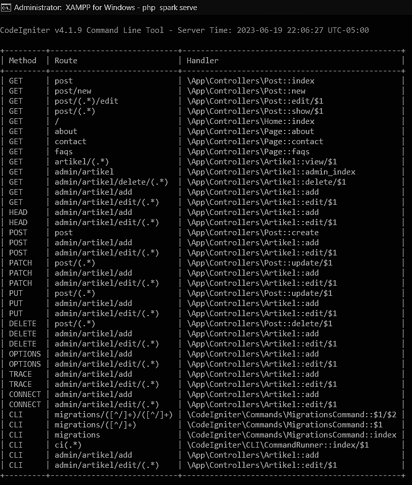
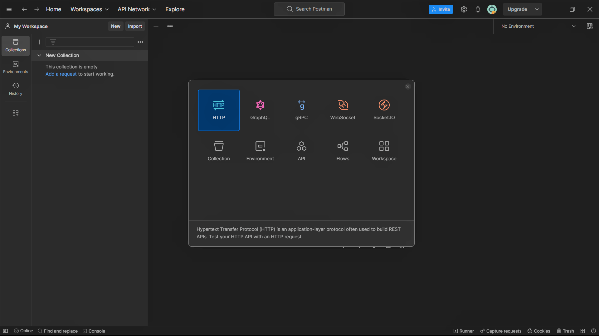
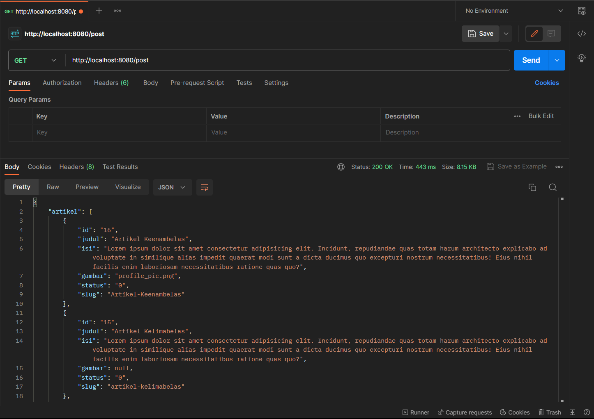
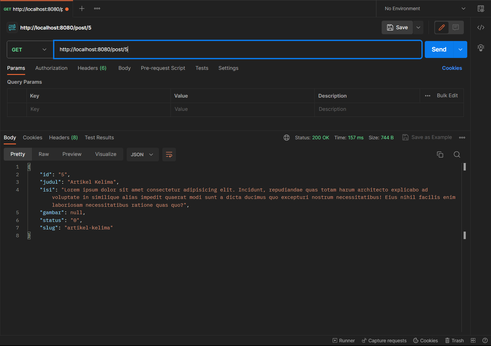
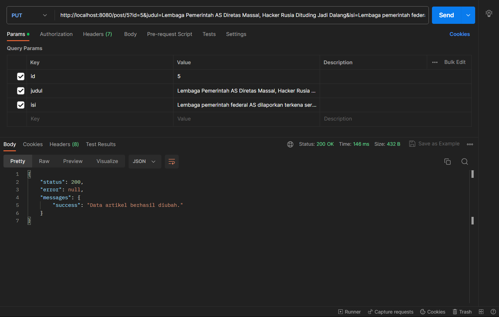
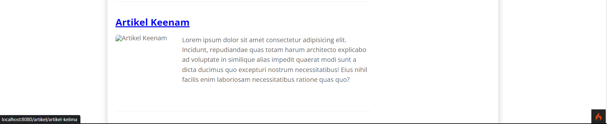
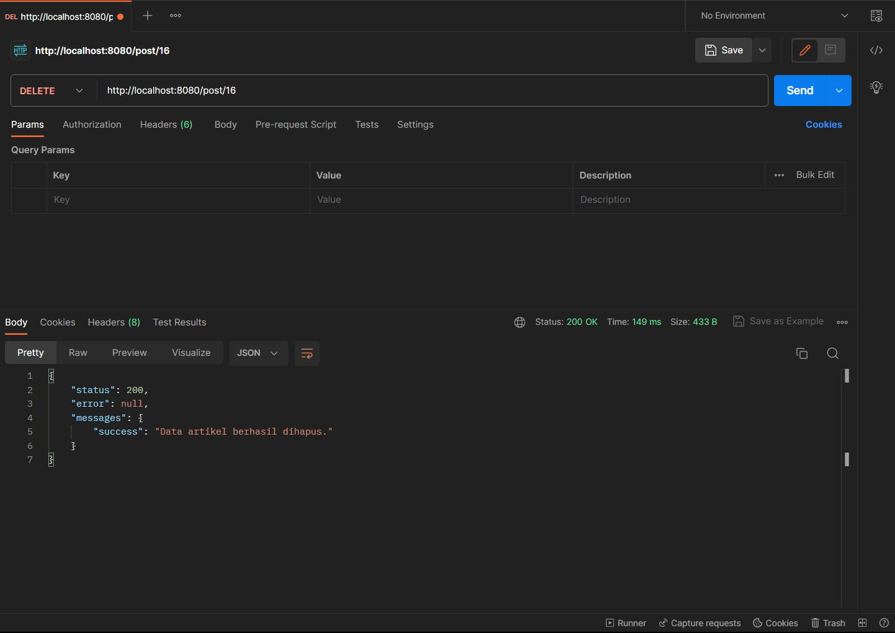

## Rest Api Menggunakan POSTMAN
Periapan awal adalah mengunduh aplikasi REST Client, ada banyak aplikasi yang dapat digunakan untuk keperluan tersebut. Salah satunya adalah Postman. [Postman](https://www.postman.com/) merupakan aplikasi yang berfungsi sebagai REST Client, digunakan untuk testing REST API. Unduh apliasi Postman [Disini.](https://www.postman.com/downloads/)

## Membuat Model
Pada modul sebelumnya sudah dibuat ArtikelModel, pada modul ini kita akan memanfaatkan model
tersebut agar dapat diakses melalui API.

## Membuat REST Controller
Pada tahap ini, kita akan membuat file REST Controller yang berisi fungsi untuk menampilkan,
menambah, mengubah dan menghapus data. Masuklah ke direktori app\Controllers dan buatlah file
baru bernama Post.php. Kemudian, salin kode di bawah ini ke dalam file tersebut:

```php
<?php

namespace App\Controllers;

use CodeIgniter\RESTful\ResourceController;
use CodeIgniter\API\ResponseTrait;
use App\Models\ArtikelModel;

class Post extends ResourceController
{
  use ResponseTrait;
  // all users
  public function index()
  {
    $model = new ArtikelModel();
    $data['artikel'] = $model->orderBy('id', 'DESC')->findAll();
    return $this->respond($data);
  }
  // create
  public function create()
  {
    $model = new ArtikelModel();
    $data = [
      'judul' => $this->request->getVar('judul'),
      'isi' => $this->request->getVar('isi'),
    ];
    $model->insert($data);
    $response = [
      'status' => 201,
      'error' => null,
      'messages' => [
        'success' => 'Data artikel berhasil ditambahkan.'
      ]
    ];
    return $this->respondCreated($response);
  }
  // single user
  public function show($id = null)
  {

    $model = new ArtikelModel();
    $data = $model->where('id', $id)->first();
    if ($data) {
      return $this->respond($data);
    } else {
      return $this->failNotFound('Data tidak ditemukan.');
    }
  }
  // update
  public function update($id = null)
  {
    $model = new ArtikelModel();
    $id = $this->request->getVar('id');
    $data = [
      'judul' => $this->request->getVar('judul'),
      'isi' => $this->request->getVar('isi'),
    ];
    $model->update($id, $data);
    $response = [
      'status' => 200,
      'error' => null,
      'messages' => [
        'success' => 'Data artikel berhasil diubah.'
      ]
    ];
    return $this->respond($response);
  }
  // delete
  public function delete($id = null)
  {
    $model = new ArtikelModel();
    $data = $model->where('id', $id)->delete($id);
    if ($data) {
      $model->delete($id);
      $response = [
        'status' => 200,
        'error' => null,
        'messages' => [
          'success' => 'Data artikel berhasil dihapus.'
        ]
      ];
      return $this->respondDeleted($response);
    } else {
      return $this->failNotFound('Data tidak ditemukan.');
    }
  }
}
```

<p>Kode diatas berisi 5 method, yaitu:</p>

- index() – Berfungsi untuk menampilkan seluruh data pada database.
- create() – Berfungsi untuk menambahkan data baru ke database.
- show() – Berfungsi untuk menampilkan suatu data spesifik dari database.
- update() – Berfungsi untuk mengubah suatu data pada database.
- delete() – Berfungsi untuk menghapus data dari database.


## Membuat Routing REST API
- Untuk mengakses REST API CodeIgniter, kita perlu mendefinisikan route-nya terlebih dulu.
Caranya, masuklah ke direktori app/Config dan bukalah file Routes.php. Tambahkan kode
di bawah ini:</p>

```php
$routes->resource('post');
```

- Untuk mengecek route nya jalankan perintah berikut:

```bash
php spark routes
```

- Selanjutnya akan muncul daftar route yang telah dibuat.



- Seperti yang terlihat, satu baris kode routes yang di tambahkan akan menghasilkan banyak
Endpoint.

- Selanjutnya melakukan uji coba terhadap REST API CodeIgniter.

## Testing REST API CodeIgniter
- Buka aplikasi postman dan pilih create new → HTTP Request



### Menampilkan Semua Data 
- Pilih method GET dan masukkan URL berikut: http://localhost:8080/post
- Lalu, klik Send. Jika hasil test menampilkan semua data artikel dari database, maka pengujian
berhasil.



### Menampilkan Data Spesifik
- Masih menggunakan method GET, hanya perlu menambahkan ID artikel di belakang URL
seperti ini: http://localhost:8080/post/5

- Selanjutnya, klik Send. Request tersebut akan menampilkan data artikel yang memiliki ID
nomor 5 di database.



### Mengubah Data
- Untuk mengubah data, silakan ganti method menjadi PUT. Kemudian, masukkan URL artikel
yang ingin diubah. Misalnya, ingin mengubah data artikel dengan ID nomor 5, maka masukkan
URL berikut: http://localhost:8080/post/5
- Selanjutnya, Masukkan nama atribut tabel pada kolom KEY dan nilai data yang baru pada kolom VALUE. Kalau sudah,
klik Send.



- Maka hasilnya akan seperti ini.



### Menghapus Data
- Pilih method DELETE untuk menghapus data. Lalu, masukkan URL spesifik data mana yang
ingin di hapus. Misalnya, ingin menghapus data nomor 16, maka URL-nya seperti ini: http://localhost:8080/post/16
- Langsung saja klik Send, maka akan mendapatkan pesan bahwa data telah berhasil dihapus dari
database.




## Terima Kasih!
